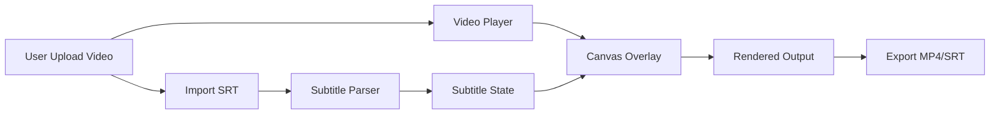

# 🏆 AMKyawDev Recap App

<p align="center">
  
  
  
  
</p>

> A powerful video subtitle editing application with dual frontend support - Web (Next.js) and Desktop (Flutter). Burn subtitles into videos directly in the browser using FFmpeg WASM technology.

## 📋 Table of Contents

- [🌟 Features](#-features)
- [🏗️ System Architecture](#️-system-architecture)
- [🛠️ Tech Stack](#️-tech-stack)
- [📁 Project Structure](#-project-structure)
- [🚀 Quick Start](#-quick-start)
- [💻 Development](#-development)
- [🔧 Configuration](#-configuration)
- [📦 Deployment](#-deployment)
- [🤝 Contributing](#-contributing)
- [📄 License](#-license)

---

## 🌟 Features

| Feature | Description |
|---------|-------------|
| 🎬 **Video Playback** | Stream videos with real-time subtitle overlay rendering |
| ✏️ **SRT Editor** | Full-featured subtitle editor with import/export SRT support |
| 🎨 **Customization** | Customize font family, size, color, and background opacity |
| ⚡ **Client-side Processing** | Video processing entirely in-browser using FFmpeg WASM |
| 💾 **Dual Export** | Export burned subtitles to MP4 or download standalone SRT |
| 🌐 **Multi-Platform** | Works on Web (Next.js) and Desktop (Flutter) |

### Core Capabilities

- ✅ Real-time subtitle rendering with customizable styling
- ✅ SRT file parsing and generation
- ✅ Frame-accurate subtitle timing
- ✅ Video timeline scrubbing
- ✅ Batch subtitle operations
- ✅ Responsive design for all devices

---

## 🏗️ System Architecture

```
┌─────────────────────────────────────────────────────────────────────────────────────────┐
│                          CLIENT LAYER                                              │
├─────────────────────────────┬───────────────────────────────────────┤
│     Next.js Web Frontend     │      Flutter Desktop/Web                │
│     (Port: 3000)           │      (Port: 8080)                     │
├─────────────────────────────┴───────────────────────────────────────┤
│                           RENDERING ENGINE                                  │
│  ┌─────────────────┐    ┌─────────────────┐    ┌─────────────┐  │
│  │  Video Player   │    │ Canvas Layer  │    │ Subtitle    │  │
│  │  Component   │───▶│ (Overlay)    │◀───│ Renderer   │  │
│  └─────────────────┘    └──────────────┘    └─────────────┘  │
├─────────────────────────────────────────────────────────────────┤
│                         CORE SERVICES                                   │
│  ┌─────────────────┐    ┌─────────────────┐                    │
│  │  FFmpeg WASM    │    │  Subtitle      │                    │
│  │  Processor     │    │  Parser       │                    │
│  └─────────────────┘    └───────────────────┘                    │
├─────────────────────────────────────────────────────────────────┤
│                          DATA LAYER                                    │
│  ┌─────────────────┐    ┌─────────────────┐    ┌─────────────┐  │
│  │  Video File   │    │  SRT File      │    │  Settings  │  │
│  │  (Upload)   │    │  (Import/Exp) │    │  (Local)   │  │
│  └─────────────────┘    └───────────────┘    └─────────────┘  │
└─────────────────────────────────────────────────────────────────┘
```

### Data Flow



---

## 🛠️ Tech Stack

### Frontend Technologies

| Category | Technology | Version | Description |
|----------|------------|---------|-------------|
| **Web Framework** | Next.js | 14.x | React SSR framework |
| **UI Library** | React | 18.x | Component-based UI |
| **Language** | TypeScript | 5.x | Type-safe development |
| **Video Processing** | FFmpeg WASM | 0.12.x | Browser-based video processing |
| **Styling** | CSS Modules | - | Scoped CSS styling |

### Desktop Technologies

| Category | Technology | Version | Description |
|----------|------------|---------|-------------|
| **Framework** | Flutter | 3.x | Cross-platform UI |
| **Language** | Dart | 3.x | Flutter's programming language |
| **State Management** | Provider | - | Flutter state management |
| **File Picker** | file_picker | 6.x | Native file dialogs |
| **Video Playback** | video_player | 2.x | Flutter video player |

### Infrastructure

| Category | Tool | Purpose |
|----------|------|---------|
| **Container** | Docker | Isolated运行环境 |
| **Orchestration** | Docker Compose | Multi-service deployment |
| **Version Control** | Git | Source code management |

---

## 📁 Project Structure

```
movie-flutter/
├── 📂 docs/                         # Documentation
│   
├── 📂 nextjs-frontend/              # Web Application
│   ├── 📂 public/
│   │   ├── 📂 fonts/               # Custom fonts
│   │   └── 📂 ffmpeg/              # FFmpeg WASM binaries
│   └── 📂 src/
│       ├── 📂 app/                 # Next.js pages (App Router)
│       │   ├── animation-loader/   # Splash screen
│       │   ├── main/              # Dashboard
│       │   ├── editing/            # Subtitle editor
│       │   ├── preview/           # Export page
│       │   └── about/             # Information
│       ├── 📂 components/          # Reusable UI components
│       │   ├── VideoPlayer.tsx     # Video playback
│       │   ├── SubtitleEditor.tsx # SRT editor
│       │   ├── EditingOptions.tsx # Style customization
│       │   └── ...
│       ├── 📂 hooks/               # Custom React hooks
│       │   ├── useFFmpeg.ts        # FFmpeg WASM hook
│       │   └── useSubtitleEdit.ts   # Subtitle operations
│       ├── 📂 utils/               # Utility functions
│       │   ├── ffmpegLoader.ts    # WASM initialization
│       │   ├── subtitleParser.ts  # SRT parsing
│       │   └── videoProcessor.ts # Video encoding
│       └── 📂 styles/              # Global styles
│
├── 📂 flutter-app/                  # Desktop Application
│   ├── 📂 lib/
│   │   ├── 📂 pages/              # Flutter screens
│   │   │   ├── animation_loader.dart
│   │   │   ├── main_body.dart
│   │   │   ├── editing_page.dart
│   │   │   ├── preview_page.dart
│   │   │   └── about_page.dart
│   │   ├── 📂 widgets/            # Reusable widgets
│   │   │   ├── video_player.dart
│   │   │   ├── subtitle_editor.dart
│   │   │   ├── editing_options.dart
│   │   │   └── upload_button.dart
│   │   └── 📂 services/           # Business logic
│   │       ├── subtitle_service.dart
│   │       ├── ffmpeg_service.dart
│   │       └── video_service.dart
│   └── 📂 assets/                 # Static assets
│
├── 📂 docker/                     # Docker configurations
│   ├── Dockerfile.nextjs
│   └── Dockerfile.flutter
│
├── docker-compose.yml             # Multi-container orchestration
├── docker-compose.production.yml # Production config
├── .env.example                  # Environment template
├── CHANGELOG.md                 # Version history
├── CONTRIBUTING.md               # Contribution guide
└── README.md                   # This file
```

---

## 🚀 Quick Start

### Prerequisites

| Requirement | Minimum Version | Notes |
|--------------|----------------|-------|
| Node.js | 18.x LTS | For Next.js frontend |
| Flutter | 3.x | For desktop app |
| Docker | 24.x | For containerized deployment |
| Docker Compose | 2.x | For orchestration |

### Option 1: Docker Compose (Recommended)

```bash
# Clone the repository
git clone https://github.com/amkyawdev/movie-flutter.git
cd movie-flutter

# Start all services
docker-compose up --build

# Access the applications
# - Next.js: http://localhost:3000
# - Flutter Web: http://localhost:8080
```

### Option 2: Manual Setup

#### Next.js Frontend

```bash
# Navigate to frontend directory
cd nextjs-frontend

# Install dependencies
npm install

# Start development server
npm run dev

# Open http://localhost:3000
```

#### Flutter Desktop

```bash
# Navigate to Flutter app directory
cd flutter-app

# Get dependencies
flutter pub get

# Run on desktop
flutter run -d macos    # macOS
flutter run -d windows  # Windows
flutter run -d linux    # Linux

# Or run on web
flutter run -d chrome
```

---

## 💻 Development

### Environment Variables

Create a `.env.local` file in `nextjs-frontend/`:

```env
# Next.js Configuration
NEXT_PUBLIC_API_URL=http://localhost:3000
NEXT_PUBLIC_FFMPEG_WASM_PATH=/ffmpeg

# Optional Features
NEXT_PUBLIC_ENABLE_ANALYTICS=false
```

### Available Scripts

#### Next.js Frontend

| Command | Description |
|---------|-------------|
| `npm run dev` | Start development server |
| `npm run build` | Build for production |
| `npm run start` | Start production server |
| `npm run lint` | Lint code |

#### Flutter App

| Command | Description |
|---------|-------------|
| `flutter run` | Run in debug mode |
| `flutter build web` | Build web app |
| `flutter build macos` | Build macOS app |
| `flutter build windows` | Build Windows app |

### Building for Production

#### Docker Production Build

```bash
# Build production images
docker-compose -f docker-compose.production.yml build

# Run production containers
docker-compose -f docker-compose.production.yml up -d
```

#### Standalone Binary

```bash
# Next.js
cd nextjs-frontend
npm run build
npm run start

# Flutter Desktop
cd flutter-app
flutter build macos --release
```

---

## 🔧 Configuration

### FFmpeg WASM Configuration

FFmpeg WASM loads from `/public/ffmpeg/` directory. For production, ensure proper CORS headers are configured.

### Subtitle Styling Options

| Option | Type | Default | Range |
|--------|------|---------|-------|
| Font Family | string | Arial | System fonts |
| Font Size | number | 24px | 12-72px |
| Text Color | hex | #FFFFFF | Any |
| Background | rgba | #00000080 | 0-100% opacity |

---

## 📦 Deployment

### Production Checklist

- [ ] Enable HTTPS/SSL
- [ ] Configure CORS headers
- [ ] Set up CDN for static assets
- [ ] Configure proper memory limits for FFmpeg
- [ ] Set up monitoring and logging
- [ ] Configure backup strategy

### Recommended Platforms

| Platform | Service | Notes |
|----------|---------|-------|
| **Web** | Vercel / Netlify | Next.js optimized |
| **Desktop** | GitHub Releases | Flutter builds |
| **Container** | Railway / Render | Docker hosting |

---

## 🤝 Contributing

Contributions are welcome! Please read our [CONTRIBUTING.md](CONTRIBUTING.md) for details.

1. Fork the repository
2. Create your feature branch (`git checkout -b feature/amazing-feature`)
3. Commit your changes (`git commit -m 'Add amazing feature'`)
4. Push to the branch (`git push origin feature/amazing-feature`)
5. Open a Pull Request

---

## 📄 License

This project is licensed under the **MIT License** - see the [LICENSE](LICENSE) file for details.

---

<p align="center">
  <strong>Made with ❤️ by AMKyawDev</strong>
  <br>
  <a href="https://github.com/amkyawdev/movie-flutter">GitHub</a> •
  <a href="https://github.com/amkyawdev/movie-flutter/issues">Issues</a> •
  <a href="https://github.com/amkyawdev/movie-flutter/releases">Releases</a>
</p>